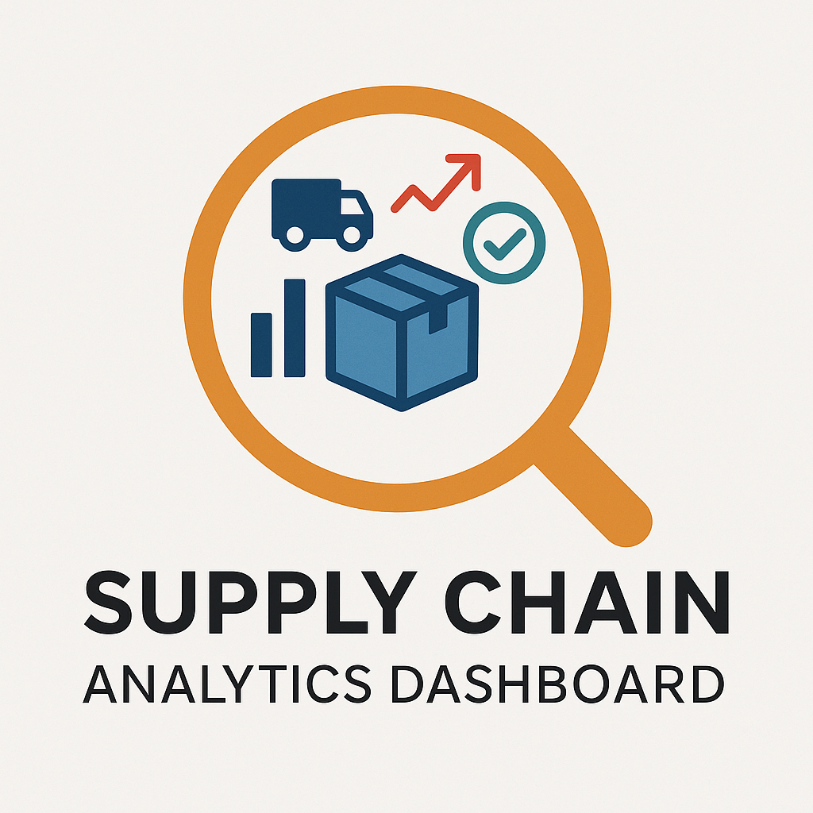
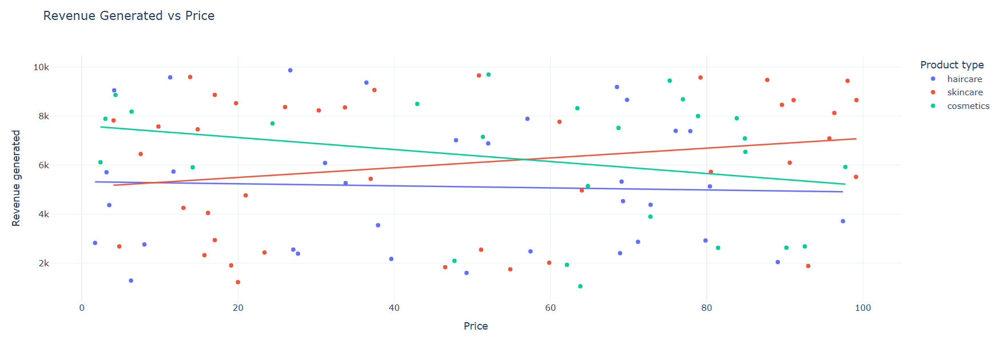
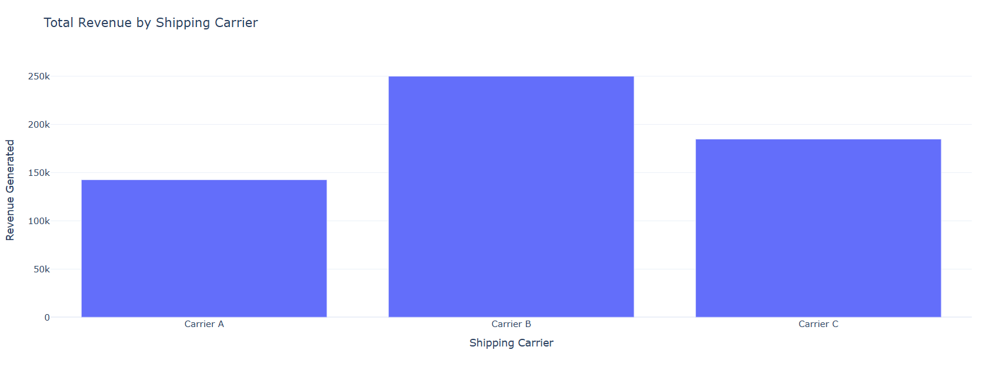
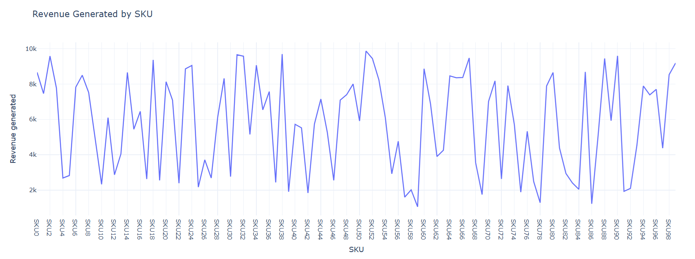

# 🚀 Supply Chain Analytics Dashboard

 <!-- Optional: Replace or remove if you don't have a logo -->

[](https://www.python.org/)
[](https://plotly.com/)
[]()

---

## 📸 Sneak Peek

<!-- Add screenshots of your charts here -->
<p align="center">
  
  
  <br>
  
  
</p>

---

## 📦 About the Project

This project brings your **supply chain data to life** using Python and Plotly. It’s designed for business analysts, operations teams, and data enthusiasts who want to:

✅ Analyze pricing and revenue trends  
✅ Visualize defect rates and manufacturing costs  
✅ Compare shipping carrier performance  
✅ Explore product-level insights like sales, orders, stock  

All in one powerful, interactive dashboard.

---

## 🧠 Features

- 📈 Revenue vs. Price analysis with trendlines
- 🥧 Interactive donut charts for product-wise sales
- 🚚 Shipping carrier revenue bar charts
- 📦 SKU-level line charts for stock, revenue, and orders
- ⚙️ Lead time and manufacturing cost comparison
- 📉 Defect rate visualizations by product and transport mode
- 💸 Shipping cost and transportation breakdown

---

## 📁 Data Requirements

This dashboard expects a CSV file named: `supply_chain_data.csv`

**Columns required:**
```text
Product type | Price | Revenue generated | Number of products sold | 
Shipping carriers | Lead time | Manufacturing costs | SKU |
Stock levels | Order quantities | Shipping costs | Transportation modes |
Costs | Defect rates
